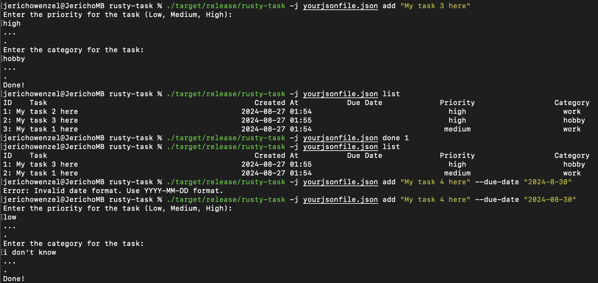

# RustyTasks

The program interface will handle these actions:

- Add new tasks to a to-do list.Remove completed tasks from that list.
- Print all the current tasks in the list (either ascending or descending).
- searches for a task

## Demo

[]( https://asciinema.org/a/fnL94GKzeeU0yLyYpFiUVlT8X?autoplay=1&speed=1.5)

## Installation / Usage

Assuming you've clone this repository

1. Inside the directory run

```sh
cargo build --release
```

 this will create an executable file that you run with `./`

or

in development, you run the crate with `cargo run` anyway, which builds and runs the crate in one step.

## Quick Start

```sh

rusty-task % ./target/release/rusty-task --help
A command line to-do app written in Rust

Usage: rusty-task [OPTIONS] <COMMAND>

Commands:
  add     Write tasks to the journal file. OPTIONS: [--due-date "yyyy-mm-dd"]
  done    Remove an entry from the journal file by position
  list    List all tasks in the journal file
  search  Search for tasks by keyword
  help    Print this message or the help of the given subcommand(s)

Options:
  -j, --journal-file <FILE>  Use a different journal file
  -h, --help                 Print help

```

